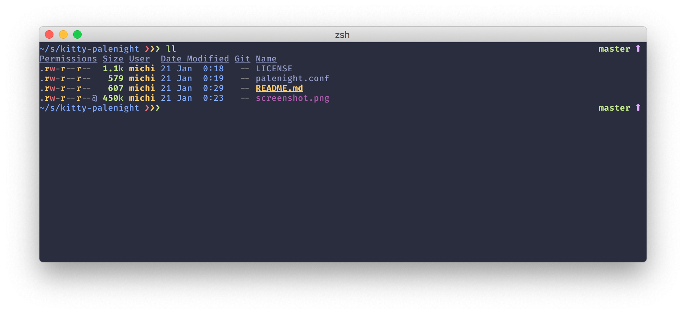

# kitty-palenight

> [kitty](https://github.com/kovidgoyal/kitty) theme based on the Palenight color variant of [Material Theme](https://marketplace.visualstudio.com/items?itemName=Equinusocio.vsc-material-theme) for VSCode.



## Install

Place the theme inside your `kitty` configuration directory:

```
$ curl -o ~/.config/kitty/ https://raw.githubusercontent.com/citizen428/kitty-palenight/master/palenight.conf
```

Then include it in your main config file:

```
# ~/.config/kitty/kitty.conf

include palenight.conf
```

## License

MIT © [Michael Kohl](https://citizen428.net)
